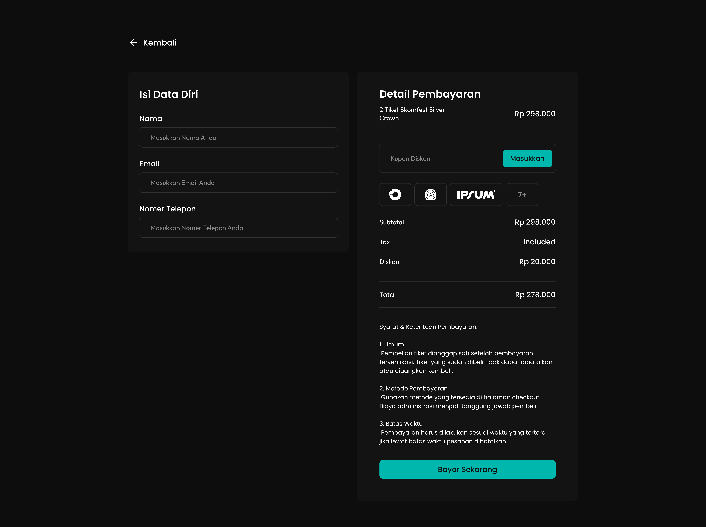

# 🎉 SKOMFEST — SKOMDA FESTIVAL

Skomfest (Skomda Festival) adalah festival musik tahunan dalam rangka Dies Natalis **SMK Telkom Sidoarjo**.  
Bukan sekadar konser, tapi wadah buat ngerasain vibes seru, musik keren, dan momen kebersamaan yang gak terlupakan ✨

🌐 **Link Website:** [skomfest.aimanwafii.my.id](https://skomfest.aimanwafii.my.id)

## 🎶 Lineup
- **PAYUNG TEDUH**
- **HINDIA**
- **REALITY CLUB**
- **FOURTWNTY**
- **PAMUNGKAS**

## 🖼️ Preview Halaman
### Landing Page

### Detail Ticket

### Ticket Payment

### Invoice

## ⚡ Fitur
- Highlight lineup musisi  
- Sistem ticketing interaktif  
- Alur pembayaran simulasi  
- Invoice tiket setelah transaksi  

## 🚀 Cara Menjalankan
Karena ini project berbasis **HTML, CSS, dan JS vanilla**, cukup buka file dengan cara:
- Klik kanan → **Open with Browser**  
- Atau gunakan extension **Live Server / Go Live** di VSCode  

## 📜 License
[MIT License](LICENSE) — silakan gunakan, tapi jangan lupa kasih credit 🙌
